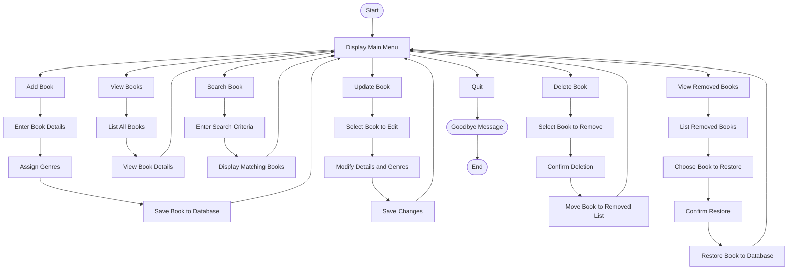
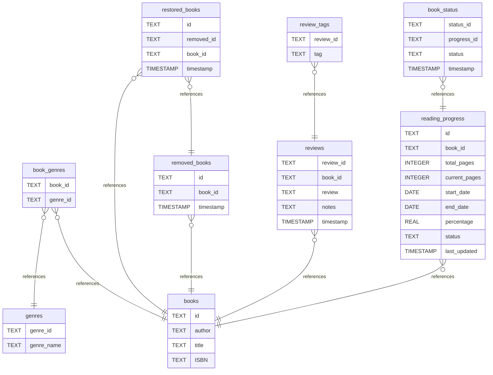

# Program Flow

```mermaid
flowchart TD
    Start([Start]) --> Menu[Display Main Menu]

    %% Add Book branch
    Menu --> Add[Add Book]
    Add --> EnterDetails[Enter Book Details]
    EnterDetails --> AssignGenres[Assign Genres]
    AssignGenres --> SaveBook[Save Book to Database]
    SaveBook --> Menu

    %% View Books branch
    Menu --> View[View Books]
    View --> ListBooks[List All Books]
    ListBooks --> ViewDetails[View Book Details]
    ViewDetails --> Menu

    %% Search Book branch
    Menu --> Search[Search Book]
    Search --> EnterSearch[Enter Search Criteria]
    EnterSearch --> ShowResults[Display Matching Books]
    ShowResults --> Menu

    %% Update Book branch
    Menu --> Update[Update Book]
    Update --> SelectEdit[Select Book to Edit]
    SelectEdit --> Modify[Modify Details and Genres]
    Modify --> SaveChanges[Save Changes]
    SaveChanges --> Menu

    %% Delete Book branch
    Menu --> Delete[Delete Book]
    Delete --> SelectDelete[Select Book to Remove]
    SelectDelete --> ConfirmDelete[Confirm Deletion]
    ConfirmDelete --> MoveRemoved[Move Book to Removed List]
    MoveRemoved --> Menu

    %% View Removed Books branch
    Menu --> Removed[View Removed Books]
    Removed --> ListRemoved[List Removed Books]
    ListRemoved --> ChooseRestore[Choose Book to Restore]
    ChooseRestore --> ConfirmRestore[Confirm Restore]
    ConfirmRestore --> Restore[Restore Book to Database]
    Restore --> Menu

    %% Quit branch
    Menu --> Quit[Quit]
    Quit --> Goodbye([Goodbye Message])
    Goodbye --> End([End])
```
# DATABASE FLOW

```mermaid
erDiagram
	book_genres }o--|| books : references
	book_genres }o--|| genres : references
	reading_progress }o--|| books : references
	book_status }o--|| reading_progress : references
	reviews }o--|| books : references
	review_tags }o--|| reviews : references
	removed_books }o--|| books : references
	restored_books }o--|| removed_books : references
	restored_books }o--|| books : references

	books {
		TEXT id
		TEXT author
		TEXT title
		TEXT ISBN
	}

	genres {
		TEXT genre_id
		TEXT genre_name
	}

	book_genres {
		TEXT book_id
		TEXT genre_id
	}

	reading_progress {
		TEXT id
		TEXT book_id
		INTEGER total_pages
		INTEGER current_pages
		DATE start_date
		DATE end_date
		REAL percentage
		TEXT status
		TIMESTAMP last_updated
	}

	book_status {
		TEXT status_id
		TEXT progress_id
		TEXT status
		TIMESTAMP timestamp
	}

	reviews {
		TEXT review_id
		TEXT book_id
		TEXT review
		TEXT notes
		TIMESTAMP timestamp
	}

	review_tags {
		TEXT review_id
		TEXT tag
	}

	removed_books {
		TEXT id
		TEXT book_id
		TIMESTAMP timestamp
	}

	restored_books {
		TEXT id
		TEXT removed_id
		TEXT book_id
		TIMESTAMP timestamp
	}

```
# Genres 

``` mermaid
erDiagram
    LITERATURE ||--o{ FICTION : "contains"
    LITERATURE ||--o{ NONFICTION : "contains"

    FICTION ||--o{ "Children's Literature" : "includes"
    "Children's Literature" ||--o{ "Picture Books" : "includes"
    "Children's Literature" ||--o{ "Chapter Books" : "includes"
    "Children's Literature" ||--o{ "Middle-Grade Books" : "includes"
    "Children's Literature" ||--o{ "Young Adult Fiction" : "includes"

    FICTION ||--o{ GENRE_FICTION : "categorized as"
    GENRE_FICTION ||--o{ FANTASY : "includes"
    FANTASY ||--o{ "Dark Fantasy" : "includes"
    FANTASY ||--o{ "Contemporary Fantasy" : "includes"
    FANTASY ||--o{ "Urban Fantasy" : "includes"
    FANTASY ||--o{ "Epic Fantasy" : "includes"
    FANTASY ||--o{ "Magical Realism" : "includes"

    GENRE_FICTION ||--o{ "SCIENCE_FICTION" : "includes"
    "SCIENCE_FICTION" ||--o{ Cyberpunk : "includes"
    "SCIENCE_FICTION" ||--o{ Steampunk : "includes"
    "SCIENCE_FICTION" ||--o{ "Space Opera" : "includes"
    "SCIENCE_FICTION" ||--o{ "Apocalyptic Fiction" : "includes"
    "SCIENCE_FICTION" ||--o{ "Climate Fiction" : "includes"

    GENRE_FICTION ||--o{ HORROR : "includes"
    HORROR ||--o{ "Body Horror" : "includes"
    HORROR ||--o{ "Psychological Horror" : "includes"
    HORROR ||--o{ "Monster Horror" : "includes"
    HORROR ||--o{ "Supernatural Horror" : "includes"

    GENRE_FICTION ||--o{ ROMANCE : "includes"
    ROMANCE ||--o{ "Contemporary Romance" : "includes"
    ROMANCE ||--o{ "Historical Romance" : "includes"
    ROMANCE ||--o{ "Paranormal Romance" : "includes"

    GENRE_FICTION ||--o{ MYSTERY : "includes"
    MYSTERY ||--o{ "Detective Fiction" : "includes"
    MYSTERY ||--o{ "Crime Fiction" : "includes"
    MYSTERY ||--o{ "Thriller" : "includes"

    NONFICTION ||--o{ "Academic Nonfiction" : "includes"
    NONFICTION ||--o{ "Biographical Nonfiction" : "includes"
    NONFICTION ||--o{ "Professional Nonfiction" : "includes"
    "Professional Nonfiction" ||--o{ "Business Books" : "includes"
    "Professional Nonfiction" ||--o{ "Technology Books" : "includes"

    NONFICTION ||--o{ "Personal Development" : "includes"
    "Personal Development" ||--o{ "Self-Help" : "includes"
    "Personal Development" ||--o{ "Wellness" : "includes"

    NONFICTION ||--o{ "Cultural Nonfiction" : "includes"
    "Cultural Nonfiction" ||--o{ "History" : "includes"
    "Cultural Nonfiction" ||--o{ "Social Sciences" : "includes"
```