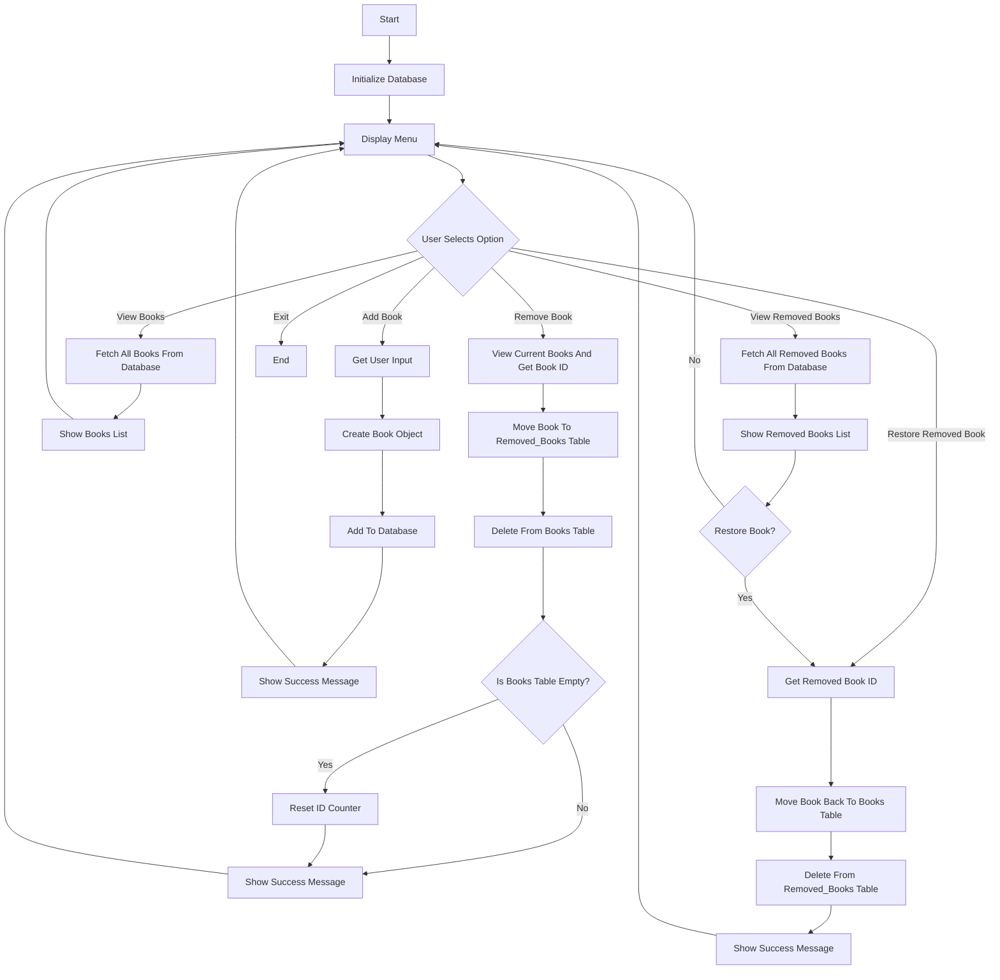

# Book Tracker App Documentation

---

## Database Schema

### books

| Column | Type    | Constraints         | Description                |
|--------|---------|---------------------|----------------------------|
| id     | INTEGER | PRIMARY KEY, AUTOINCREMENT | Unique book ID             |
| title  | TEXT    | NOT NULL            | Book title                 |
| author | TEXT    | NOT NULL            | Book author                |
| isbn   | TEXT    |                     | Book ISBN (optional)       |
| year   | TEXT    |                     | Publication year (optional)|

### removed_books

| Column | Type    | Constraints         | Description                |
|--------|---------|---------------------|----------------------------|
| id     | INTEGER | PRIMARY KEY, AUTOINCREMENT | Unique removed book ID      |
| title  | TEXT    | NOT NULL            | Book title                 |
| author | TEXT    | NOT NULL            | Book author                |
| isbn   | TEXT    |                     | Book ISBN (optional)       |
| year   | TEXT    |                     | Publication year (optional)|

---

## Program Flowchart

